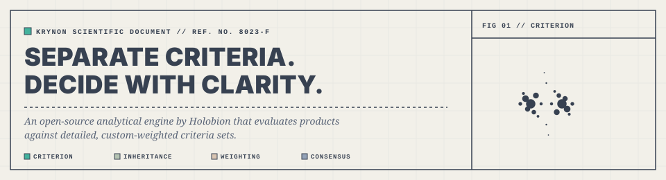

<p align="center">
  
</p>

# Krynon

An open-source analytical classification engine owned and maintained by the [Holobion](https://github.com/Holobion) organisation.

## What is Krynon?

Krynon is an analytical classification engine designed to help users find the exact food or object that fits their specific needs. Instead of relying on generic five-star reviews, it evaluates items against a custom set of detailed characteristics.

By breaking down products into their fundamental attributes, Krynon empowers users to make objective, data-driven decisions that align perfectly with their priorities.

The name is derived from the ancient Greek verb *krinein*, meaning "to separate," "to sort," or "to decide"—which is also the etymological root of the word "criterion." It perfectly encapsulates the project's mission: providing a precise, analytical tool to filter out the noise and highlight what truly matters.

## Core Mechanics

- Multi-Criteria Sorting: Classify and compare items based on a wide range of specific features (e.g., build quality, reparability index, price, environmental impact, or taste).
- Custom Weighting: Users can assign different levels of importance to each criterion. If reparability matters more than price, the ranking dynamically adjusts to reflect that preference.
- Tailored Discovery: The engine processes the data to cut through marketing noise, delivering a personalized ranking that highlights the most logical choice.

## Getting Started

### Prerequisites

- [List any prerequisites here, e.g., Rust, Docker, etc.]

### Installation

1. **Clone the repository:**

    ```bash
    git clone [repository_url]
    cd Krynon
    ```

2. **Set up environment variables:**
    Copy the example environment file and fill in your database credentials:

    ```bash
    cp .env.example .env
    ```

    Edit the `.env` file with your PostgreSQL connection details.

3. **Set up the database:**
    This project uses Docker Compose to manage the PostgreSQL database.
    Ensure you have Docker and Docker Compose installed.
    Run the following command to start the PostgreSQL container:

    ```bash
    docker compose up -d postgres
    ```

    This will create a PostgreSQL database instance. Migrations are automatically run by the application on startup.

### Running the Project

#### 1. Local Development (Native)

To run the Dioxus application natively on your host machine:

```bash
dx serve
```

This will run the fullstack application in development mode (with hot reloading enabled).

#### 2. Local Development (Docker Containerized)

To run the entire application stack (the app and the database) inside Docker with full support for file watching and automatic reloading (hot-reloading):

```bash
docker compose -f docker-compose.dev.yaml up --watch --build
```

- `--watch`: Enables Docker Compose Watch. Whenever you save a file on the host machine, it is synced to the container, triggering Dioxus CLI (`dx serve`) inside the container to hot-reload or rebuild the application instantly.
- `--build`: Rebuilds the container images if the Dockerfile configuration has changed.

The application will be served at `http://localhost:8080`.

#### 3. Production Deployment

For production deployments, the application is packaged using a multi-stage Docker build (`Dockerfile`) that compiles a highly-optimized release version of the Rust Axum server and compiles client assets to WASM.

To deploy the production stack:

1. **Configure Environment Variables**: Ensure your `.env` contains production-safe credentials:
   - `POSTGRES_USER`
   - `POSTGRES_PASSWORD`
   - `POSTGRES_DB`
   - `APP_PORT`

2. **Run the production containers**:

   ```bash
   docker compose up -d --build
   ```

   This will build the optimized production image using `Dockerfile` and start both the application container and the PostgreSQL database container in the background.

3. **Monitor Logs**:

    ```bash
    docker compose logs -f
    ```

## Continuous Integration & Deployment

Every push to `main` triggers the [`Docker` workflow](.github/workflows/docker.yml), which builds the production image from `Dockerfile` and publishes it to the **GitHub Container Registry**:

```txt
ghcr.io/holobion/krynon
```

The image is published under several tags, derived from `Cargo.toml`'s `version` field (the single source of truth):

| Tag              | When                                                     |
| ---------------- | -------------------------------------------------------- |
| `latest`         | On every push to `main`                                  |
| `0.1.0`          | Matches the `version` field in `Cargo.toml`              |
| `sha-<short>`    | Always, for traceability                                 |

To release a new version, **just bump `version` in `Cargo.toml` and push to `main`** — no git tags required. The image will be rebuilt and republished automatically under the new version tag (and `latest`).

### Local Git Hook: Auto-Bump on Push

A [pre-push hook](.githooks/pre-push) is included to keep the version in `Cargo.toml` in sync with your work. When you push to `main` and `Cargo.toml` is part of the pushed commits, the hook automatically bumps the **minor** version (e.g. `0.1.0` → `0.2.0`) and appends a `chore(release): bump version to X.Y.Z` commit before the push goes through.

**Install once per clone:**

```bash
git config core.hooksPath .githooks
```

**Skip for a single push:**

```bash
git push --no-verify
```

**How it works end-to-end:**

1. You commit changes to a feature branch and merge to `main`.
2. You run `git push origin main`.
3. The pre-push hook detects `Cargo.toml` in the diff, bumps the minor version, and commits the change.
4. The push goes through with the new commit included.
5. The `Docker` workflow runs, reads the new version from `Cargo.toml`, and publishes the image to GHCR.

## Project Structure

- `src/`: Contains the main application code.
  - `db.rs`: Database connection and interaction logic.
  - `model.rs`: Data models.
  - `main.rs`: Application entry point.
  - `components/`: Dioxus UI components.
  - `views/`: Application views/pages.
- `migrations/`: SQL migration files for the database schema.
- `docker-compose.yml`: Docker Compose configuration for the PostgreSQL database.
- `Dockerfile`: Multi-stage production build (release server + WASM assets).
- `.env.example`: Example environment variables for database configuration.
- `.github/workflows/`: GitHub Actions CI/CD workflows.
- `.githooks/`: Tracked git hooks (see [Continuous Integration & Deployment](#continuous-integration--deployment)).

## Resources & Links

- **Repository**: [https://github.com/Holobion/Krynon](https://github.com/Holobion/Krynon)
- **Organisation**: [https://github.com/Holobion](https://github.com/Holobion)

## License

This project is licensed under the Mozilla Public License 2.0.  
See the [LICENSE](LICENSE) file for details.

## Tech Stack

- [Rust](https://www.rust-lang.org/): Core logic and backend
- [Dioxus](https://dioxuslabs.com/): Frontend framework
- [PostgreSQL](https://www.postgresql.org/): Database
- [SQLx](https://github.com/launchbadge/sqlx): Async SQL Toolkit / ORM
- [Docker](https://www.docker.com/): Containerization
